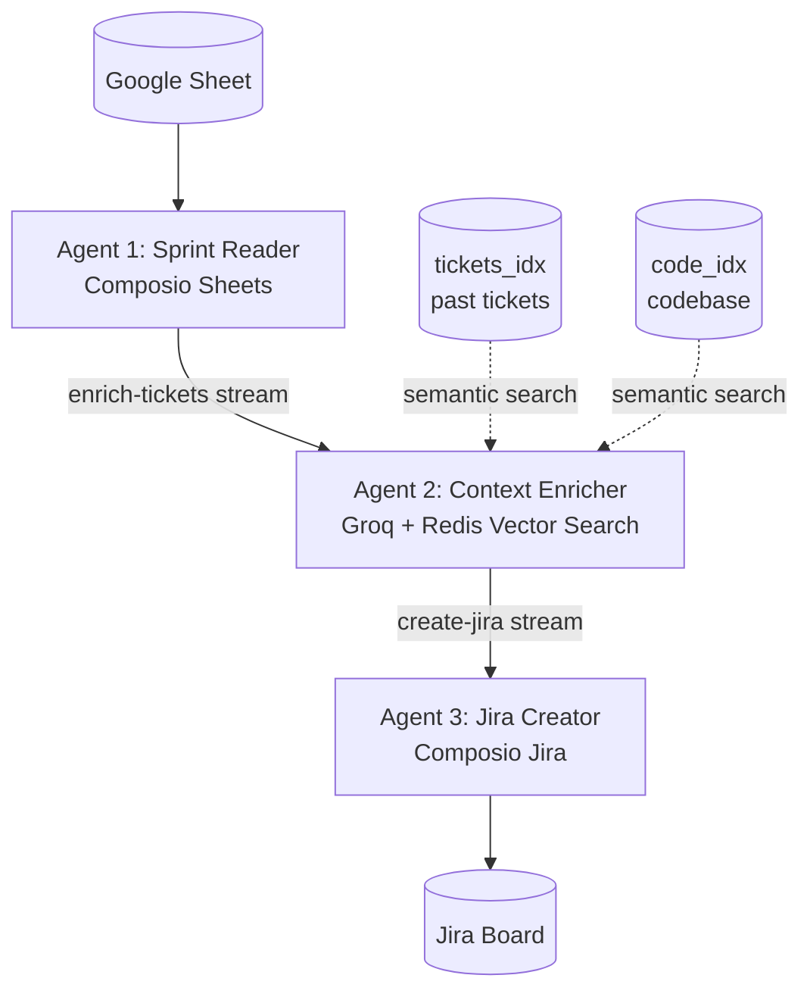

# RediSprint: AI-Powered Sprint Planning

Automates sprint planning by reading your Google Sheet, enriching each ticket using semantic search over past tickets and your codebase (via Redis Vector Search), and creating fully-described Jira issues — all orchestrated by three AI agents communicating through Redis Streams.

> **Won 1st place** at the AI Tinkerers SF Hackathon — Agents with Superpowers Context Engineering · October 2025

---

## Demo

<!-- Add your demo video link here once it is ready -->
> Demo video coming soon.

---

## Architecture



---

## Prerequisites

| Service | Free tier | Purpose |
|---|---|---|
| [Groq](https://console.groq.com) | Free tier available | LLM completions via llama-3.3-70b |
| [Redis Cloud](https://cloud.redis.io) | 30 MB free | Streams + Vector Search |
| [Composio](https://composio.dev) | Free | Google Sheets + Jira integrations |
| [Atlassian Jira](https://www.atlassian.com/software/jira) | Free (10 users) | Target for ticket creation |

---

## Local Setup

### 1. Clone and install

```bash
git clone https://github.com/YOUR_USERNAME/RediSprint.git
cd RediSprint
python -m venv .venv
source .venv/bin/activate   # Windows: .venv\Scripts\activate
pip install -r requirements.txt
```

### 2. Configure environment

```bash
cp .env.example .env
```

Edit `.env` and fill in every value:

| Variable | Where to get it |
|---|---|
| `GROQ_API_KEY` | [console.groq.com](https://console.groq.com): API Keys |
| `REDIS_URL` | Redis Cloud dashboard: Connect: copy the URL |
| `COMPOSIO_API_KEY` | Composio dashboard: Settings: API Key |
| `COMPOSIO_USER_ID` | Composio dashboard: Settings: User ID |
| `DEMO_GOOGLE_SHEET_ID` | From your Google Sheet URL (see step 4) |
| `JIRA_PROJECT_KEY` | Your Jira project key, e.g. `RED` |

### 3. Set up Composio

1. Sign up at [composio.dev](https://composio.dev)
2. In the dashboard, connect the **Google Sheets** integration
3. Connect the **Jira** integration (authorize your Atlassian account)
4. Copy your **API Key** and **User ID** into `.env`

> Make sure your Jira connection is a **Scrum board** (not Kanban) for sprint support. Go to your Jira project: Project settings: Features: enable Sprints.

### 4. Prepare your Google Sheet

1. Open `sample_data/google_sheet_template.csv` to see the required format
2. Go to [sheets.google.com](https://sheets.google.com): Create new sheet: File: Import: upload the CSV
3. Share the sheet: **Share: Anyone with the link: Viewer**
4. Copy the Sheet ID from the URL: `https://docs.google.com/spreadsheets/d/SHEET_ID_HERE/edit`
5. Add it to `.env` as `DEMO_GOOGLE_SHEET_ID`

**Required columns (Row 1 must be headers):**

| Column | Header | Example |
|---|---|---|
| A | Sprint | RediSprint |
| B | Type | Task / Bug / Story / Epic |
| C | Title | Add OAuth2 login |
| D | Client Impact | High / Medium / Low / Critical |
| E | Effort | 3, 5, 8, 13 (story points) |
| F | Owner | Jane Smith |
| G | Status | To Do / In Progress / Done |
| H | Assignee | Mrunal Kotkar |

The system auto-detects the **latest sprint** (last unique value in column A) and only processes that sprint's tickets.

### 5. Seed Redis indices (one-time)

```bash
# Create the vector search indices in Redis
python create_indices.py

# Ingest past tickets and codebase for semantic context
python ingest_code_and_tickets.py
```

By default, ingestion reads from `sample_data/past_tickets.csv`. Override with `TICKETS_CSV` in `.env` to use your own Jira export, or set `CODE_DIR` to point at a different codebase.

### 6. Run

```bash
python web_ui.py
```

Open [http://localhost:8000](http://localhost:8000).

- The Sheet ID input is pre-filled with your `DEMO_GOOGLE_SHEET_ID`
- Paste any Sheet ID that follows the required column format
- Click **Run Sprint Automation** and watch the three agents work in real time

---

## How It Works

1. **Agent 1 (Sprint Reader):** reads all rows from your Google Sheet via Composio, identifies the latest sprint name, and pushes each ticket onto the `enrich-tickets` Redis Stream.

2. **Agent 2 (Context Enricher):** pulls each ticket, runs hybrid vector search over `tickets_idx` (past Jira tickets) and `code_idx` (codebase), then calls Groq (llama-3.3-70b) to write an enriched description referencing actual code files and past work. The result is pushed onto the `create-jira` Redis Stream.

3. **Agent 3 (Jira Creator):** pulls each enriched ticket and uses Composio's Jira tools to create a fully-populated Jira issue with assignee, story points, sprint assignment, and status transition.

All inter-agent communication uses **Redis Streams**, making the pipeline async, observable, and easy to extend.

---

## Project Structure

```
RediSprint/
├── a2a_agents.py                  # Three agents + Redis Streams orchestration
├── web_ui.py                      # Flask web interface (SSE streaming, sheet ID input)
├── ingest_code_and_tickets.py     # One-time ingestion into Redis vector indices
├── create_indices.py              # Creates tickets_idx and code_idx in Redis
├── templates/
│   └── index.html                 # Web UI (agent pipeline, sheet config, terminal)
├── sample_data/
│   ├── google_sheet_template.csv  # Import into Google Sheets as your sprint input
│   └── past_tickets.csv           # Sample historical tickets for semantic context
├── .env.example                   # Environment variable template
└── requirements.txt
```
